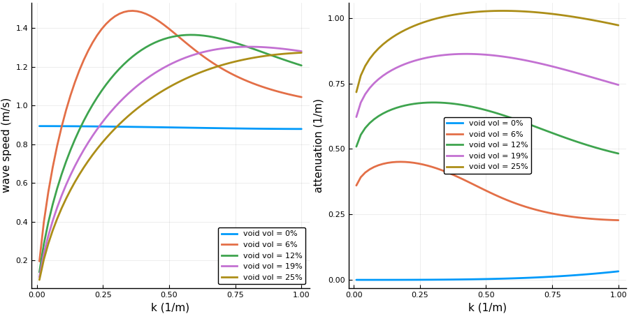

# Intro
Show how to choose two species (types of particles), vary the particle volume fractions, and plot the resulting sound speed and attenuation.
```julia
using EffectiveWaves

## Choose two species randomly (uniformly) distributed in the medium
# Usage Specie(ρ = density, r = radius, c = wavespeed, volfrac = volume fraction)
species = [
    Specie(ρ=WaterDistilled.ρ,r=30.e-6, c=WaterDistilled.c, volfrac=0.1),
    Specie(ρ=Inf, r=100.0e-6, c=2.0, volfrac=0.2)
]
# background medium
background = Glycerol # for other materials, see materials.jl

# angular frequencies
ωs = LinRange(0.01,1.0,60)*30.0e6

# using only one effective wavenumber per angular frequencies. This wavenumber is calculated from an asymptotic formula for low particle volume fraction
k_effs = wavenumber_low_volfrac(ωs, background, species)

speeds = ωs./real(k_effs)
attenuations = imag(k_effs)

using Plots
pyplot()

p1 = plot(ωs./real(background.c), speeds,  ylabel="wave speed (m/s)", xlabel="k (1/m)");
p2 = plot(ωs./real(background.c), attenuations, ylabel="attenuation (1/m)", xlabel="k (1/m)");
plot(p1,p2)
savefig("speed_and_atten.png")
```


## Change the volume fraction of the two species

```julia

# for fixed total volume fraction
background = Medium(ρ=1.0,c = 1.0)
ωs = LinRange(0.01,1.0,60)
volfrac = 0.25
r1 = 0.5
r2 = 1.5
N=5
vols = LinRange(0.0,1.0,N)*volfrac

kTs_arr = [
  begin
    sp1 = Specie(0.0, r1; volfrac=vols[i])
    sp2 = Specie(Inf, r1; volfrac=volfrac-vols[i])
    [ wavenumber_low_volfrac(ω, background, [sp1,sp2]) for ω in ωs]
  end
for i = 1:N];

speeds = [ ωs./real(kTs) for kTs in kTs_arr]
attenuations = imag(kTs_arr)

# height=450
# pyplot(linewidth=2, size=(2*height,height))
# labs = reshape( map(v -> "void vol = $(Int(round(100*v)))%",vols),1, length(vols));
# p1 = plot(ωs./real(background.c), speeds, labels=labs, ylabel="wave speed (m/s)" ,xlabel="k (1/m)");
# p2 = plot(ωs./real(background.c), attenuations, labels=labs, xlabel="k (1/m)", ylabel="attenuation (1/m)");
# plot(p1,p2)
# savefig("vary_volfrac.png")
```

