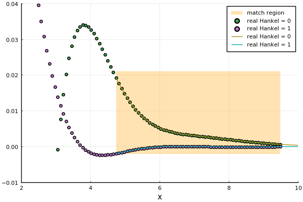
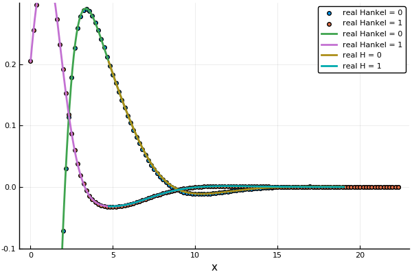

# A numerical matching method
Both of these methods calculate the ensemble average wave in a particulate material. To do so, we need to specify the geometry of the material, as this ultimately determines the fields. We choose the simplest case which is a halfspace x>0 filled with particles.
```julia
using EffectiveWaves

## choose a 2D acoustic medium which is highly attenuating material
    spatial_dim = 2
    medium = Acoustic(spatial_dim; ρ=1.0, c=1.0)

    # Plane wave source
    direction = [1.0,1.0]
    source = PlaneSource(medium,direction)

    # a species of circular particles
    ms = MultipleScattering # in case you load a package which has it's own definition of Circle.
    specie = Specie(Particle(medium, ms.Circle(0.8)); volume_fraction = 0.2)

    # a halfspace with outward normal [-1.0,0.0] and filled with specie
    material = Material(Halfspace([-1.0,0.0]), specie)


    ω = 1.0
    θin = 0.3 # angle made between incident wave direction and the material boundary

    # calculate the 4 effective waves with the smallest attenuation
    wave_effs = effective_waves(ω, medium, specie;
          num_wavenumbers=5,
          θin = θin,
          extinction_rescale = false
    )
    # plot(wave_effs[1:5])
    # savefig("wave_effs.png")
```


To determine the amplitude of these effective waves we used the newly developed matched method.
```julia
    match_wave = MatchPlaneWaveMode(ω, medium, specie;
      θin = θin,
      wave_effs = wave_effs[1:5],
      max_size=80)

    # the error of the match is used as a proxy to determine if the method converged. That is, the match_error is the difference between a sum of the effective waves and a discrete solution.
    match_error(match_wave)

    # plot(match_wave, ylim=(-0.1,0.3), xlab = "x", hankel_indexes=0:1)
    # savefig("match_wave.png")
```


We can compare this results against a purely numerical method, which requires a much larger mesh.
```julia
  discrete_wave = DiscretePlaneWaveMode(ω, medium, specie; θin = θin, max_size=700)

  plot(discrete_wave, ylim=(-0.1,0.3), xlab = "x", hankel_indexes=0:1)
  plot!(match_wave, seriestype=:line, match_region=false, hankel_indexes=0:1)
  savefig("compare_match_wave.png")
```
The two fields perfectly overlap, as the matched method is an exact method. Below the line is from the matched method, while the scatter points are from the purely numerical method.

