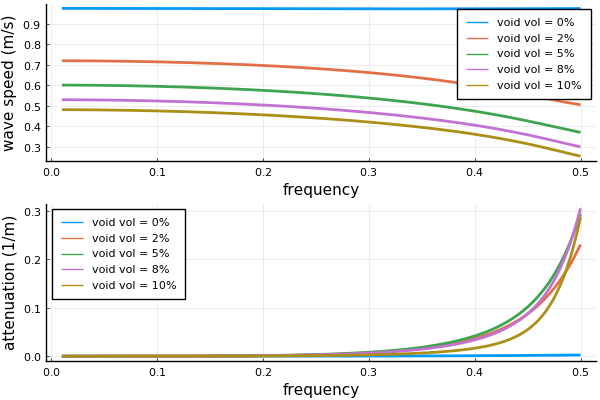

# Vary volume fraction of the two species

Here we demonstrate how varying the volume fraction of two different species of particles changes the effective wave speed and attenuation.

```julia
using EffectiveWaves

# for fixed total volume fraction
background = Medium(ρ=1.0,c = 1.0)
ωs = LinRange(0.01,1.0,60)
volfrac = 0.25
r1 = 0.5
r2 = 1.5
N=5
vols = LinRange(0.0,1.0,N)*volfrac

ks_arr = map(1:N) do i
    sp1 = Specie(0.0, r1; volfrac=vols[i])
    sp2 = Specie(Inf, r1; volfrac=volfrac-vols[i])
    [ wavenumber_low_volfrac(ω, background, [sp1,sp2]) for ω in ωs]
end

speeds = [ ωs ./ real(ks) for ks in ks_arr]
attenuations = imag.(ks_arr)
```
## Plot the results
```julia
labs = reshape( map(v -> "void vol = $(Int(round(100*v)))%",vols),1, length(vols));
p1 = plot(ωs, speeds,
    labels=labs, ylabel="wave speed (m/s)" ,xlabel="frequency");
p2 = plot(ωs, attenuations,
    labels=labs, xlabel="frequency", ylabel="attenuation (1/m)");
plot(p1,p2,layout=(2,1))
```

