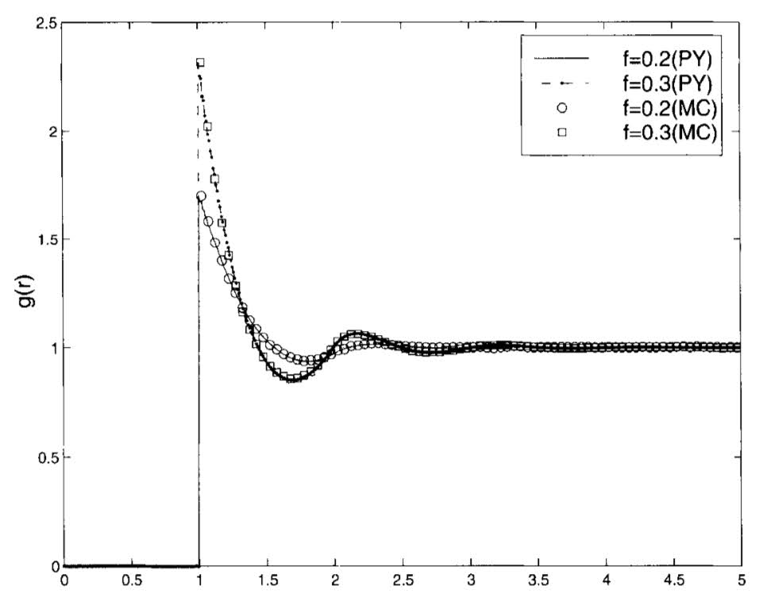

# Pair correlation

In the previous example there was no mention on how the particles are distributed. This can be specified by choosing a pair correlation. Choosing the particle distribution only affects the effective wavenumbers and wavemodes, see refs...

## Percus-Yevick

Let us consider a material filled with only one type of particle

```jldoctest pair; setup = :(using EffectiveWaves), output = false, filter = r".*"s
medium = Acoustic(3; ρ=1.2, c=1.0)

# Choose the species
r = 0.5
s = Specie(
    Acoustic(3; ρ = 0.1, c = 0.1),
    Sphere(r),
    volume_fraction = 0.3,
    exclusion_distance = 1.01
);

# output

```
Next we create a microstructure that has only this species, and has a specific pair-correlation

```jldoctest pair; output = false, filter = r".*"s

pair_type = PercusYevick(3; rtol = 1e-2, maxsize = 200)

micro = Microstructure(s, pair_type);

# output
```
and we can plot the result (needs the packages Plots and Image)
```julia
using Plots

plot(micro.paircorrelations[1].r, 1.0 .+ micro.paircorrelations[1].dp,
    xlab = "distance", ylab = "P-Y"
)
```


which we can compare with Figure 8.3.1 from [1] below.



Note that for $x < 1$ the two particles of radius 0.5 would overlap, so the pair correlation should be zero. Also note that `dp` is the variation from uncorrelated, which is why we add 1.0 to get the pair correlation.

## Calculate an effective wavenumber

The more points sampled within the pair correlation the longer it will take to calculate the effective wavenumber.

First we calculate the wavenumbers with the simplest pair correlation (hole correction), and then compare the results with Percus-Yevick.

```jldoctest pair; output = false, filter = r".*"s

micro = Microstructure(s);

ω = 0.4

kps = wavenumbers(ω, medium, micro;
    basis_order = 1, num_wavenumbers = 4
)

pair_type = PercusYevick(3; meshsize = 0.1, maxsize = 50)
micro = Microstructure(s, pair_type);

kps2 = wavenumbers(ω, medium, micro;
    basis_order = 1, num_wavenumbers = 4
)

# output

```
we can then compare how the wavenumbers change with Percus-Yevick with a scatter plot
```julia pair
using Plots

scatter(kps, lab = "Hole correction")
scatter!(kps2, lab = "Percus-Yevick")

```


We can see that in this case, the effective wavenumbers with (`kps2`) and without (`kps`) Percus Yevick are quite different.

## Calculate reflection
To calculate the average reflection, or scattering, from a material is the same as before, except we just need to replace `Species` with `Microstructure`. For example to calculate reflection from a plate:
```jldoctest pair; output = false, filter = r".*"s

k_eff = kps2[1]

normal = [0.0,0.0,-1.0] # an outward normal to both surfaces of the
width = 150.0 # plate width
origin = [0.0,0.0,width/2] # the centre of the plate

plate = Plate(normal,width,origin)

# note below we use micro instead of species
material = Material(plate, micro)

source = PlaneSource(medium, [0.0,0.0,-1.0])

# Calculate the wavemode for the first wavenumber
# the WaveMode function calculates the types of waves and solves the needed boundary conditions
wavemodes = WaveMode(ω, k_eff, source, material; tol = 1e-6, basis_order = 1);

RTeff = reflection_transmission_coefficients(wavemodes, source, material)

# output


```
We can compare the result of not using Percus-Yevick below.
```jldoctest pair; output = false, filter = r".*"s
k_eff = kps[1]
micro = Microstructure(s);
material = Material(plate, micro)
wavemodes = WaveMode(ω, k_eff, source, material; tol = 1e-6, basis_order = 1);

RTeff = reflection_transmission_coefficients(wavemodes, source, material)

# output
```

## References

[1] Kong, Jin Au, Leung Tsang, Kung-Hau Ding, and Chi On Ao. Scattering of electromagnetic waves: numerical simulations. John Wiley & Sons, 2004.

[[2]](https://github.com/JuliaWaveScattering/EffectiveWaves.jl/blob/master/docs/src/theory/P-Y.pdf) Gerhard Kristensson. "The Percus-Yevick approximation". [github.com/JuliaWaveScattering/EffectiveWaves.jl][https://github.com/JuliaWaveScattering/EffectiveWaves.jl] (2022).
