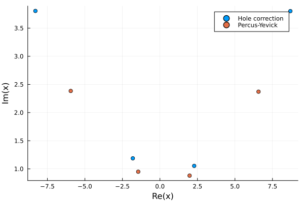

# Pair correlation

In the previous example there was no mention on how the particles are distributed. This can be specified by choosing a pair correlation, and when no pair correlation is specified, the default is to assume that particles are uncorrelated, except they can not overlap.

Choosing the particle distribution only affects the effective wavenumbers and wavemodes, see references [1,2]

We note that the definition of the pair-correlation $g$, for a finite number of multi-species particles, is [1]

$g(\mathbf r_1, \lambda_1; \mathbf r_2, \lambda_2) = \frac{p(\mathbf r_1, \lambda_1; \mathbf r_2, \lambda_2)}{p(\mathbf r_1, \lambda_1)p(\mathbf r_2, \lambda_2)}\frac{J -1}{J}$  

where $\mathbf r_j$ is the vector position of the centre of particle-$j$, $\lambda_j$ represents the size or other distinguishing properties of the type of particle, $p$ is the probability density function, and $J$ is the total number of particles. Note that when the particles become uncorrelated in the limit $|\mathbf r_1 - \mathbf r_2| \to \infty$ we have that

$\lim_{|\mathbf r_1 - \mathbf r_2| \to \infty} g(\mathbf r_1, \lambda_1; \mathbf r_2, \lambda_2) = 1$  

## Bespoke pair-correlation

Here is an example of choosing your own pair-correlation for a material filled with only one type of particle
```jldoctest pair; setup = :(using EffectiveWaves), output = false, filter = r".*"s
medium = Acoustic(3; ρ=1.2, c=1.0)

# Choose the species
r = 0.5
s = Specie(
    Acoustic(3; ρ = 0.01, c = 0.01),
    Sphere(r),
    volume_fraction = 0.3,
    separation_ratio = 1.01
);

# output

```
Next we create a microstructure that has only this species, and has a specific pair-correlation

```jldoctest pair; output = false, filter = r".*"s

r = 2.0:0.1:10.0
my_pair_correlation = 1.0 .+ 0.2 .* sin.(r) ./ r.^3

dpc = DiscretePairCorrelation(r, my_pair_correlation)

micro = Microstructure(s, dpc);

# output
```
Note that when specifying a pair-correlation, the minimal distance between particles will be taken to be `dpc.r[1]`. This is stored in `dpc.minimal_distance`. Previously when defining the `Specie` we specified `separation_ratio = 1.01`, which means the minimal distance between particles centres' is `2 * separation_ratio * r`, this is used when no pair-correlation is specified, otherwise the value given in `dpc.minimal_distance` will be used. In the future, we will phase out the use of `separation_ratio` in the Specie.  

## Percus-Yevick

Let us consider a material filled with only one type of particle and use the Percus-Yevick approximation to calculate the pair-correlation for 2D hard spheres. That is, sphere which do not attract of repel each other. For details see [Notes on Percus-Yevick](../theory/P-Y.pdf) [2].

```jldoctest pair; output = false, filter = r".*"s

pair_type = PercusYevick(3; rtol = 1e-2, maxlength = 200)

micro = Microstructure(s, pair_type);

# output
```
When calling the above, the pair correlation is calculated and stored in `micro.paircorrelations` which is a matrix of the type [`DiscretePairCorrelation`](@ref). This type assume that the pair-correlation is only a function of the distance between particles, and the types of particles, like their size.

We can plot the result of the Percus-Yevick approximation with the package Plots:
```julia
using Plots

plot(micro.paircorrelations[1].r, 1.0 .+ micro.paircorrelations[1].dp,
    xlab = "distance", ylab = "P-Y"
)
```


which we can compare with Figure 8.3.1 from [1] below.


Note that for $x < 1$ the two particles of radius 0.5 would overlap, so the pair correlation should be zero. Also note that `dp` is the variation from uncorrelated, which is why we add 1.0 to get the pair correlation.


## Calculate an effective wavenumber

The more points sampled within the pair correlation the longer it will take to calculate the effective wavenumber.

First we calculate the wavenumbers with the simplest pair correlation (hole correction), and then compare the results with Percus-Yevick.

```jldoctest pair; output = false, filter = r".*"s

micro = Microstructure(s);

ω = 0.4

kps = wavenumbers(ω, medium, micro;
    basis_order = 1, num_wavenumbers = 4
)

pair_type = PercusYevick(3; meshsize = 0.1, maxlength = 50)
micro = Microstructure(s, pair_type);

kps2 = wavenumbers(ω, medium, micro;
    basis_order = 1, num_wavenumbers = 4
)

# output

```
we can then compare how the wavenumbers change with Percus-Yevick with a scatter plot
```julia pair
using Plots

scatter(kps, lab = "Hole correction")
scatter!(kps2, lab = "Percus-Yevick")

```




We can see that in this case, the effective wavenumbers with (`kps2`) and without (`kps`) Percus Yevick are quite different.

## Calculate reflection
To calculate the average reflection, or scattering, from a material is the same as before, except we just need to replace `Species` with `Microstructure`. For example to calculate reflection from a plate:
```jldoctest pair; output = false, filter = r".*"s

k_eff = kps2[1]

normal = [0.0,0.0,-1.0] # an outward normal to both surfaces of the
width = 150.0 # plate width
origin = [0.0,0.0,width/2] # the centre of the plate

plate = Plate(normal,width,origin)

# note below we use micro instead of species
material = Material(plate, micro)

source = PlaneSource(medium, [0.0,0.0,-1.0])

# Calculate the wavemode for the first wavenumber
# the WaveMode function calculates the types of waves and solves the needed boundary conditions
wavemodes = WaveMode(ω, k_eff, source, material; tol = 1e-6, basis_order = 1);

RTeff = reflection_transmission_coefficients(wavemodes, source, material)

abs.(RTeff)

# output


```
We can compare the result of not using Percus-Yevick below.
```jldoctest pair; output = false, filter = r".*"s
k_eff = kps[1]
micro = Microstructure(s);
material = Material(plate, micro)
wavemodes = WaveMode(ω, k_eff, source, material; tol = 1e-6, basis_order = 1);

RTeff = reflection_transmission_coefficients(wavemodes, source, material)

abs.(RTeff)

# output

```

## References

[1] Kong, Jin Au, Leung Tsang, Kung-Hau Ding, and Chi On Ao. Scattering of electromagnetic waves: numerical simulations. John Wiley & Sons, 2004.

[[2]](https://github.com/JuliaWaveScattering/EffectiveWaves.jl/blob/master/docs/src/theory/P-Y.pdf) Gerhard Kristensson. "The Percus-Yevick approximation". [github.com/JuliaWaveScattering/EffectiveWaves.jl](https://github.com/JuliaWaveScattering/EffectiveWaves.jl]) (2022).

[[3]](https://iopscience.iop.org/article/10.1088/1367-2630/abdfee/pdf) Gower, Artur L., and Gerhard Kristensson. "Effective waves for random three-dimensional particulate materials." New Journal of Physics 23.6 (2021): 063083.
