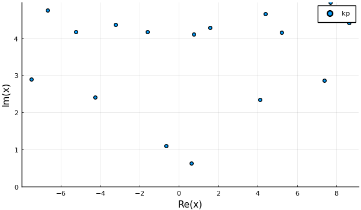
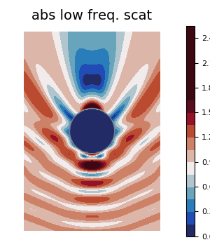
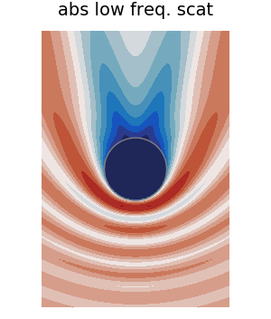
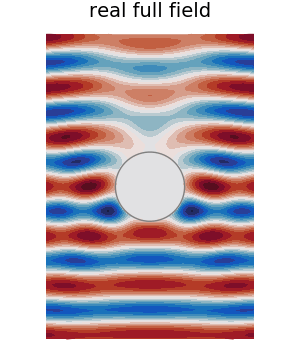
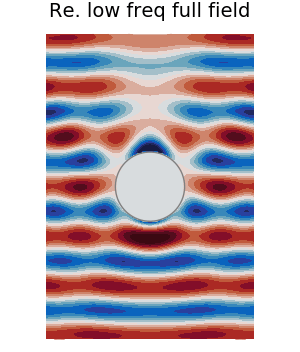

# Scattering from a sphere

Here we show how to calculate the average acoustic wave scattered from a sphere filled with particles. We will the analytic solution with an approximation using effective low frequency properties.


## Choose the microstructure
```julia
using EffectiveWaves, LinearAlgebra

spatial_dim = 3
medium = Acoustic(spatial_dim; ρ=1.0, c=1.0)

s1 = Specie(
    Acoustic(spatial_dim; ρ=10.0, c=10.0), Sphere(spatial_dim, 1.0);
    volume_fraction=0.15
);
s2 = Specie(
    Acoustic(spatial_dim; ρ=0.22, c=0.22), Sphere(spatial_dim, 1.0);
    volume_fraction=0.05
);
species = [s1,s2]

# calculate the low frequency effective properties
eff_medium = effective_medium(medium, species)

# choose incident angular frequency
ω = 0.22

# choose maximum order of the spherical harmonic for scattered waves from particles
basis_order = 2

# choose a numerical tolerance
tol = 1e-7

# calculate the effective wavenumbers which are valid for any frequency low frequency effective properties
opts = Dict(
    :num_wavenumbers => 2, # calculate at least 3 wavenumbers
    :basis_order => basis_order,
    :tol => tol
)

# note this is the heaviest calculation in this example
k_effs = wavenumbers(ω, medium, species; opts...)
```

## Is one effective wavenumber enough?
To easily calculate scattered waves we need `k_effs[1]` to have a smaller imaginary part than the other wavenumbers `k_effs[2:end]`. This is easily checked with a scatter plot

```julia
using Plots
pyplot(size = (600, 350))

scatter(k_effs, lab = "kp", ylims = (0.0,Inf))  
# savefig("../assets/sphere-wavenumbers.png")
```


When using only one wavenumber, and excluding the other wavenumber, will lead to an error that is roughly given by
```julia
λ = 2π * medium.c / ω
approximate_error = abs(exp(im * λ * k_effs[2]) / exp(im * λ * k_effs[1]))

# output

1.5188e-6 # approximately
```
The precise error depends on the application.

## Define the source and material
As we want to calculate effective scattered waves, and not just effective wavenumbers, we need to define a source and material domain. We will choose a plane-wave source, and a sphere for the domain.  
```julia
# choose an incident wave
# NOTE: having the incident wave direction along the z-axis leads to azimuthal symmetry, which simplifies the next steps.
θ = 0.0
psource = PlaneSource(medium, [sin(θ),0.0,cos(θ)]);

# choose the size and position of the spherical domain of the material
R = 20.0
material = Material(medium,Sphere(spatial_dim, R),species);

# the larger the material region, the larger this basis_field_order needs to be
basis_field_order = 7
```

## Calculate the scattered waves
Below we calculate the outward going spherical wave coefficients. These coefficients, multiplied with a basis of outward going waves, will give the scattered field.
```julia
# create a sphere using the low frequency effective properties
effective_sphere = Particle(eff_medium, material.shape)

region_order = basis_order + basis_field_order

# calculate the T-matrix, also know as scattering matrix, and take the diagonal
t_mat = t_mat(effective_sphere, medium, ω, region_order);

# calculate the outward going spherical wave coefficients
source_coefficients = regular_spherical_coefficients(psource)(region_order,zeros(3),ω);
scat_low_coefficients = t_mat * source_coefficients

# for the analytic solution, we need the wavemode first
wave = WaveMode(ω, k_effs[1], psource, material;
        tol=tol,
        basis_order = basis_order,
        basis_field_order = basis_field_order
)

# and then the outward spherical wave coefficients
scat_coefficients = material_scattering_coefficients(wave)
```

## Calculate the field
```julia
xlim = 3.0 * R
ylim = 4.4 * R

# a region to plot
region = Box([[-xlim,-ylim], [xlim,ylim]]);

# a quick fix to make it a 3D region
xs, xinds = points_in_shape(region; res = 180);
xs = [[x[1],0,x[2]] for x in xs];

# Calculate the field for the low frequency effective properties
particles = [Particle(eff_medium,material.shape)]
sim = FrequencySimulation(particles, psource)
fs = field(sim, ω, xs[xinds], scat_low_coefficients);

field_mat = zeros(typeof(fs[1]), length(xs), 1);
field_mat[xinds,:] = fs;
result_low = FrequencySimulationResult(field_mat, xs, [ω])


# Calculate the analytic scattered field
fs = field(sim, ω, xs[xinds], scat_coefficients);

field_mat = zeros(typeof(fs[1]), length(xs), 1);
field_mat[xinds,:] = fs;
result = FrequencySimulationResult(field_mat, xs, [ω])
```

## Plot the field
```julia

pyplot( frame = :axes,
    size = (xlim * 5.0, ylim * 4.0),
    flip = false,
    xlims = :auto, ylims = :auto,
    title="", xlab="ka",ylab="y"
)

plot(result_low, ω, seriestype = :contour, field_apply=abs
, color = :balance # for julia 1.1 change to color = :pu_or
, levels = 16, clims=(0.0,1.65)
, title = "abs low freq. scat"
, axis=false)
plot!(material.shape)
p_scat = plot!(leg = false, frame = :none
,axis=false, xlab="",ylab="")

# savefig("../assets/low-freq-scat-sphere.png")
```


```julia
plot(result,ω, seriestype = :contour, field_apply=abs
, levels = 16, clims=(0.0,1.65)
, title = "abs scattered field"
, color = :balance
, colorbar = false
)
plot!(material.shape)
plot!(leg = false
, axis=false, xlab="",ylab="")

# savefig("../assets/scat-sphere.png")
```


# Plot a gif

Finally, for fun, we plot a GIF of the real part of the full field.

```julia
max_c = maximum(abs.(field(result)))
min_c = - max_c

ts = LinRange(0.,2pi/ω,30)

anim = @animate for t in ts
    plot(result, ω, seriestype=:contour
        , levels = 20
        , phase_time=t
        , leg = false
        , field_apply = real
        , clim = (min_c, max_c)
        , colorbar = false
        , color = :balance
        , frame = :none
        , title = "Re. full field"
    )
    plot!(material.shape)
    plot!(leg = false, frame = :none
    , axis=false, xlab="",ylab="")

end
# gif(anim,"../assets/real-sphere-scatter.gif", fps = 7)

anim = @animate for t in ts
    plot(result_low, ω, seriestype=:contour
        , levels = 20
        , phase_time=t
        , leg = false
        , field_apply = real
        , clim = (min_c, max_c)
        , colorbar = false
        , color = :balance
        , frame = :none
        , title = "Re. low freq full field"
    )
    plot!(material.shape)
    plot!(leg = false, frame = :none
    , axis=false, xlab="",ylab="")

end
# gif(anim,"../assets/real-sphere-low-scat-scatter.gif", fps = 7)

```



# A sphere with radial symmetry

The simplest possible scenario with a finite number of particles is radial symmetry. That is, to excite a sphere filled with uniformly distributed particles with a radially symmetric incident field.

At first it may appear that the scenario of radial symmetry is a very specific case and perhaps not that useful. However, the paper ? shows that the same effective wavenumbers appear for both the radial symmetry case and all other cases including  plane wave incidence on a plate.

Below we show two different methods: using just one effective wavenumber and another which solves a 1D integral equation which includes all effective wavenumbers

## Effective wave with radial symmetry
Let us first choose the material parameters again
```julia
Using EffectiveWaves

ω = 0.1
medium = Acoustic(3; ρ=1.0, c=1.0);

# Choose the particle properties
particle_medium = Acoustic(3; ρ=8.0, c=8.0);

r = 1.0;
s1 = Specie(
    particle_medium, Sphere(r);
    volume_fraction = 0.1
)


k = ω  / medium.c;
ka = k * r;
# here we use the Percus-Yevick approximation for the inter particle pair-correlation
py_pair = PercusYevick(3; meshsize = 0.12, maxlength = 30, rtol = 1e-4)
microstructure = Microstructure(medium, [s1], py_pair)

# Choose the material properties
R = 5.0

material = Material(Sphere(R),microstructure);
Symmetry(material,source) == RadialSymmetry{3}()

# Choose a radially symmetric source
source = regular_spherical_source(medium, [1.0+0.0im];
   position = [0.0,0.0,0.0],
   symmetry = RadialSymmetry{3}()
);

# Calculate the effective wavenumbers and wavemode
basis_order = Int(round(2.0 * ka)) .+ 1

keffs = wavenumbers(ω, microstructure;
    basis_order = basis_order,
    symmetry = PlanarAzimuthalSymmetry()
)

wave = WaveMode(ω, keffs[1], source, material;
    basis_order = basis_order
)

# Calculate the scattering coefficients from the whole material
scattering_coefficients = material_scattering_coefficients(wave);
# Due to radial symmetry scattering_coefficients has only one component


# Calculate the far-field patterns
Ys = spherical_harmonics(0, 0.0, 0.0);
u∞ = sum((1/k) .* Ys[1] .* scattering_coefficients[1] .* exp.(-(pi*im/2)))
```

## Integral method with radial symmetry
Below shows how to use the same parameters defined above to solve a 1D integral equation.

```julia
# The integral methods requires a number to determine how fine the mesh should be
basis_field_order = Int(round(0.5 * k .* R)) .+ 1
basis_field_order = max(2,basis_field_order)

# This depends on the pair-correlation chosen. It depends how many Fourier series to use to represent the pair-correlation
polynomial_order = 10;

# This solves the integral equation and may take a few minutes
discretewave = discrete_system_radial(ω, source, material, Symmetry(source,material);
    basis_order = basis_order,
    basis_field_order = basis_field_order,
    polynomial_order = polynomial_order
);
scattering_coefficients2 = material_scattering_coefficients(discretewave)

u∞2 = (1/k) * Ys[1] * scattering_coefficients2[1] * exp(-(pi*im/2))
abs(u∞ - u∞2) / abs(u∞) < 1e-3
```

## Full Integral method with radial symmetry
Below is a method which takes the integral equation and does not use radial symmetry to simplify it. This removes the Gibb's phenomena which comes with using a Fourier series to approximate the pair-correlation, but requires more mesh points to reach the same level of precision.

```julia

rtol = 1e-2; maxevals = Int(1e5);

dwave = discrete_system(ω, source, material;
    basis_order = basis_order,
    basis_field_order = basis_field_order,
    rtol = rtol, maxevals = maxevals,
);

scattering_coefficients_discrete = material_scattering_coefficients(dwave)
u∞_discrete = (1/k) * Ys[1] * scattering_coefficients_discrete[1] * exp(-(pi*im/2))

abs(u∞ - u∞_discrete) / abs(u∞) < 1e-3
abs(u∞2 - u∞_discrete) / abs(u∞) < 3e-4
```
