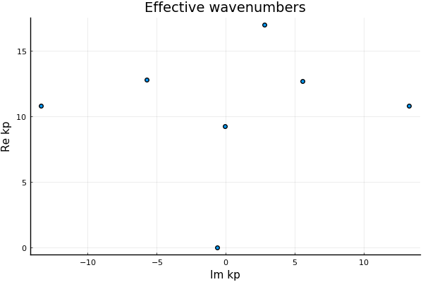
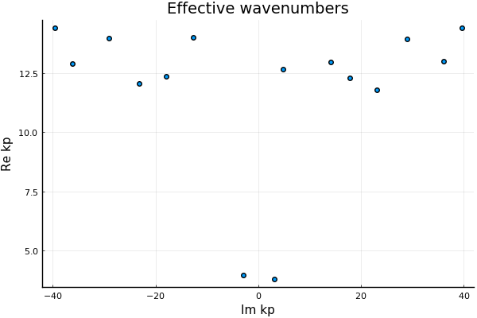

# Effective wavenumbers

As the effective wavenumbers depend only on the microstructure, we need only specify the [`Specie`](@ref)s and the background's [`PhysicalMedium`](@ref)s properties. At present only [`Acoustic`](@ref) mediums are defined.

In the background, this package solves the dispersion equation for plane-waves, as this is simpler. Though we are able to formulate and solve dispersion equations for other waves, see example ...

For the low frequency and low volume fraction limits, there exist simple analytic formulas that give only one effective wavenumber. Beyond these limits, there are multiple wavenumbers in the [general case](@ref wavenumber_general).

## Low frequency

In the low frequency limit there are explicit formulas for any volume fraction of particles. These formulas have been confirmed by a number of different analytic methods.

For acoustics in 3 dimensions we can calculate the effective properties, which we illustrate for the effective density $\rho_*$ and bulk modulus $\beta_*$:

$\frac{1}{\beta_*} = \frac{1}{\beta} + \frac{\langle\Delta \beta_*\rangle}{\beta},$

$\rho_* = \rho \frac{1 -\langle\Delta \rho_* \rangle}{1 + 2 \langle\Delta \rho_* \rangle},$

where[^1]

[^1]: The sums below are actually approximations of integrals over $\varphi_j$.

$\langle \Delta \beta_* \rangle  =  \sum_j \frac{\beta - \beta_j}{\beta_j}  \varphi_j,$

and

$\langle \Delta \rho_* \rangle  =  \sum_j \frac{\rho - \rho_j}{\rho + 2 \rho_j}   \varphi_j,$

where $\varphi_j$ is the volume fraction occupied by the particles with the properties $\beta_j$ and $\rho_j$, so that $\sum_j \varphi_j = \varphi$, the total particle volume fraction. Note that for spheres $\varphi_j = \frac{4 \pi a_j^3}{3} n_j$, where $a_j$ is the radius of the $j$ specie, and $n_j$ is the number of particles of the $j$ specie per volume.


We use the code below to calculate these quantities.

```jldoctest 2; setup = :(using EffectiveWaves)
spatial_dim = 3
medium = Acoustic(spatial_dim; ρ=1.2, c=1.5)

# Choose the species
radius1 = 0.001
s1 = Specie(
    Acoustic(spatial_dim; ρ=10.2, c=10.1), radius1;
    volume_fraction=0.2
);

radius2 = 0.002
s2 = Specie(
    Acoustic(spatial_dim; ρ=0.2, c=4.1), radius2;
    volume_fraction=0.15
);
species = [s1,s2]

# Choose the frequency
ω = 1e-2
k = ω / real(medium.c)

# Check that we are indeed in a low frequency limit
k * radius2 < 1e-4

# output

true
```

From these we can get the effective sound speed $c_* = \sqrt{\beta_*/ \rho_*}$ and the effective wavenumber $k_* = \omega / c_*$.
```jldoctest 2
eff_medium = effective_medium(medium, species)
eff_medium.c

# output

1.735082366476732 + 0.0im
```


## Low volume fraction

In the limit of a low volume fraction of particles, there we again have explicit formulas. These formulas are more accurate for weak scatterers, i.e. particles that do not scatter much energy.
```jldoctest 2; output = false

# Choose the species
radius1 = 0.3
s1 = Specie(
    Acoustic(spatial_dim; ρ=10.2, c=10.1), radius1;
    volume_fraction=0.02
);

radius2 = 0.2
s2 = Specie(
    Acoustic(spatial_dim; ρ=0.2, c=4.1), radius2;
    volume_fraction=0.03
);
species = [s1,s2]

# Choose the frequency
ω = 1.0

# output

1.0
```
As we are dealing with finite frequency, we can specify `basis_order` the number of multi-poles to consider. In 3D `basis_order` is maximum degree of the spherical harmonics. This parameter should be increased when increasing the frequency.
```jldoctest 2; output = false, filter = r".*"s
basis_order = 2
k1 = wavenumber_low_volumefraction(ω, medium, species; basis_order = basis_order);

# output

0.6477267068908865 + 3.20821643199973e-5im
```

## [The general case](@id wavenumber_general)
In the general case, there are multiple effective wavenumbers $k_p$ for the same incident frequency. These $k_p$ require numerical optimisation to find (together with the help of asymptotics). This task can be the most computational demanding.
```julia

# Choose the species
radius1 = 0.3
s1 = Specie(
    Acoustic(spatial_dim; ρ=10.2, c=10.1), radius1;
    volume_fraction=0.2
);

radius2 = 0.2
s2 = Specie(
    Acoustic(spatial_dim; ρ=0.2, c=4.1), radius2;
    volume_fraction=0.1
);
species = [s1,s2]

# Choose the frequency
ω = 1.0

# Calculate at least 5 of the effective wavenumbers
kps = wavenumbers(ω, medium, species; basis_order = 2, num_wavenumbers = 5)
```
If you have the `Plots` package installed, you can then visualise the result
```julia
using Plots

scatter(kps,
    xlab = "Im kp", ylab = "Re kp", lab = ""
    , title = "Effective wavenumbers")
```


In this case there is one effective wavenumber $k_1$ with an imaginary part much smaller than the others. This means that the wavemode $\phi_1$ associated with $k_1$, see [Theoretical background](@ref), is the only wavemode which makes a significant contribution.

However, be warned! It is easy to find a case where two effective wavenumbers become important. All we need to have is a specie that scatters wave strongly. Examples of this in acoustics are gas bubbles in a background liquid, or liquid/gas pockets in a background solid.

For example, we need only lower the sound speed of `s1` above:
```julia

# Choose the species
s2 = Specie(
    Acoustic(spatial_dim; ρ=0.2, c=0.1), radius2;
    volume_fraction=0.1
);
species = [s1,s2]

# Calculate at least 5 of the effective wavenumbers
kps = wavenumbers(ω, medium, species; basis_order = 2, num_wavenumbers = 5)
```
If you have the `Plots` package installed, you can then visualise the result
```julia
using Plots

scatter(kps,
    xlab = "Im kp", ylab = "Re kp", lab = ""
    , title = "Effective wavenumbers")
```

